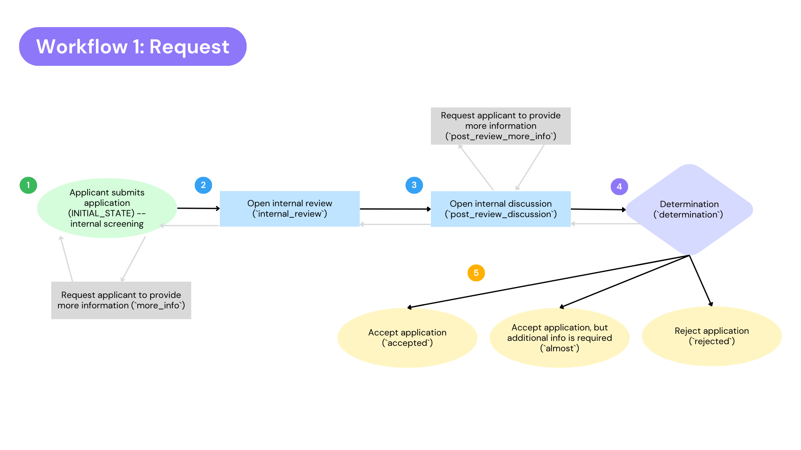
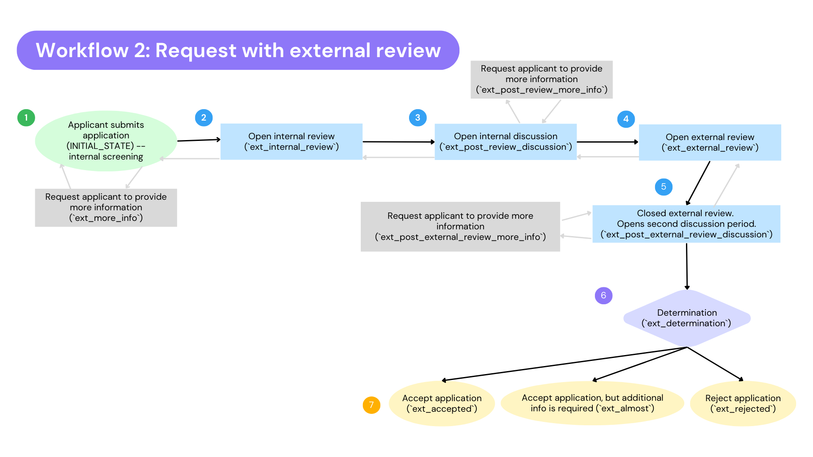
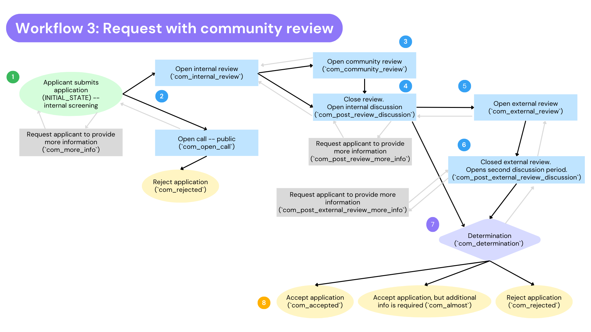
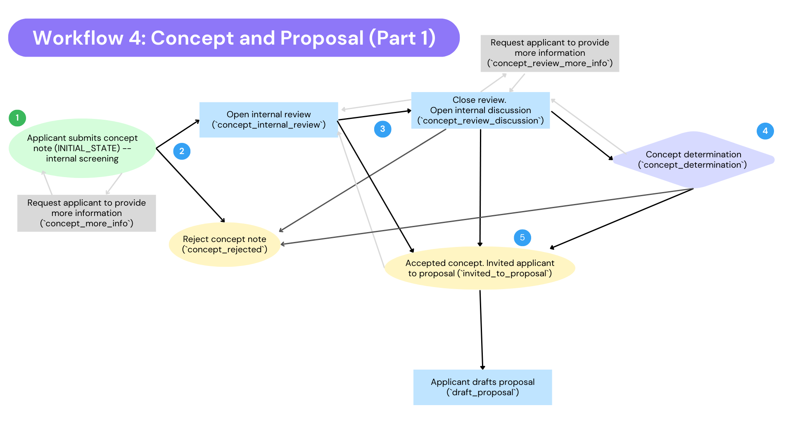
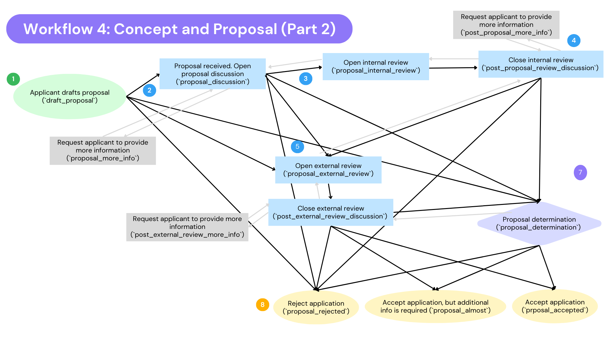

# What is a workflow?

A workflow describes the process from a submitted application, through various stages of review, to acceptance of an application.

> ℹ️ _Hypha covers more than just the application phase, but workflows are used in the application process only._

## What are the 4 workflows?

1. Request
2. Request with external review
3. Request with community review
4. Concept and proposal

All workflows begin with applicant drafting, revising and submitting an application (`DRAFT_STATE`) — only transition available is to `INITIAL_STATE`, upon applicant taking the action to submit their application/request.

### Request

The request workflow is a single stage process with no advisory council review.

Proposal Persona: Funding organization offers a rapid response fund or another type of grantmaking that requires a streamline process that does not require an external review process. This application process could also be used for in-kind services like coaching, security audits, etc.

Once an application is submitted (`INITIAL_STATE`) — it can transition into the following:

- A request for more information (`more_info`) — opens editing permissions to applicant again to revise their application to provide the information requested by the screeners.
- Open review (`internal_review`) — can transition only between closing review period (`post_review_discussion`) and reverting back to the internal screening phase.
  - `post_review_discussion` — after review is closed, you can request more information (`post_review_more_info`), ready for determination (`determination`), revert back to opening the review (`internal_review`), accept but additional info is needed (`almost`), accept (`accepted`) or reject (`rejected`)
  - `post_review_more_info` — opens editing permissions to applicant again to revise their application to provide the information requested by the reviewers.
- Ready for determination (`determination`) — can revert back to discussion (“Ready For Discussion (revert)” — `post_review_discussion`) , or accept with additional info needed (`almost`), accept (`accepted`) or reject (`rejected`)
- Accepted, but additional info is needed (`almost`) — opens editing permissions to applicant again to revise their application to provide the information requested by the reviewers, admin, or staff positions.
- Accepted (`accepted`) — application accepted. Staff can still edit this submission.
- Rejected (`rejected`) — application rejected. Permissions removed from all roles.

### Request with external review

This workflow is a single stage process with an advisory council review or external review stage -- includes functionalties for external reviewers like advisory board members to access applications and submit reviews.

Proposal Persona: This funding organization relies on external partners for evaluations. Proposals submitted to this workflow are reviewed by staff members and an advisory board that is made up of trusted community members.

Once an application is submitted (`INITIAL_STATE`) — it can transition into the following:

- A request for more information (`ext_more_info`) — opens editing permissions to applicant again to revise their application to provide the information requested by the screeners.
- Open review (`ext_internal_review`) — can transition only between closing review period (`ext_post_review_discussion`) and reverting back to the internal screening phase.
  - `ext_post_review_discussion` — after review is closed, you can request more information (`ext_post_review_more_info`), open the external review(`ext_external_review`), ready for determination (`ext_determination`), revert back to opening the review (`ext_internal_review`), or reject (`ext_rejected`)
  - `ext_post_review_more_info` — opens editing permissions to applicant again to revise their application to provide the information requested by the screeners.
- External review (`ext_external_review`) — can only transition between closing the review (`ext_post_external_review_discussion`) and reverting back to discussion (`ext_post_review_discussion`)
  - `ext_post_external_review_discussion` — can transition to a request more information (`ext_post_external_review_more_info`), ready for determination (`ext_determination`), revert back to opening the external review (`ext_external_review`), accept but additional info is needed (`ext_almost`), accept (`ext_accepted`) or reject (`ext_rejected`)
  - `ext_post_external_review_more_info` — opens editing permissions to applicant again to revise their application to provide the information requested by the reviewers.
- Ready for determination (`ext_determination`) — can revert back to discussion (“Ready For Discussion (revert)” — `ext_post_external_review_discussion`) , or accept with additional info needed (`ext_almost`), accept (`ext_accepted`) or reject (`ext_rejected`)
- Accepted, but additional info is needed (`ext_almost`) — opens editing permissions to applicant again to revise their application to provide the information requested by the reviewers, admin, or staff positions.
- Accepted (`ext_accepted`) — application accepted. Staff can still edit this submission.
- Rejected (`ext_rejected`) — application rejected. Permissions removed from all roles.

### Request with community review

This workflow is a single stage process with an advisory council review or external review stage.

Proposal Persona: This funding organization works with the community to co-design a meaningful definition of success. Applications are reviewed by staff members and an advisory board that is made up of trusted community members.

Once an application is submitted (`INITIAL_STATE`) — it can transition into the following:

- A request for more information (`com_more_info`) — opens editing permissions to applicant again to revise their application to provide the information requested by the screeners.
- Open call (public) (`com_open_call`) — from here- the only two transitions available are to either revert back to screening or to reject the application (`com_rejected`)
- Open Review (`com_internal_review`) — can transition to open community review (`com_community_review`), close review (`com_post_review_discussion`), revert to initial state / screening period, or reject application (`com_rejected`)
- Open Community Review — can transition to close review (`com_post_review_discussion`), revert back to opening internal review (`com_internal_review`), or rejecting application (`com_rejected`)
- Closed review (`com_post_review_discussion`) — can transition to a request for more information (`com_post_review_more_info`), open external review (`com_external_review`), mark application as ready for determination (`com_determination`), revert back to internal review (`com_internal_review`), or reject application (`com_rejected`)
  - Request more information (`com_post_review_more_info`) — opens editing permissions to applicant again to revise their application to provide the information requested by the reviewers
- Open external review (`com_external_review`) — can transition to closing review (`com_post_external_review_discussion`) or revert back to discussion (`com_post_review_discussion`)
- Closed review (`com_post_external_review_discussion`) — can transition into a request for more information (`com_post_external_review_more_info`), mark application as ready for determination (`com_determination`), revert back to external review (`com_external_review`), mark application as accepted but additional information is required (`com_almost`), accept application (`com_accepted`), or reject application (`com_rejected`)
  - Request more information (`com_post_external_review_more_info`) — opens editing permissions to applicant again to revise their application to provide the information requested by the external reviewers
- Mark application as ready for determination (`com_determination`) — can transition to revert back to marking application as ready for discussion (`com_post_external_review_discussion`), mark application as accepted but additional information is required (`com_almost`), accept application (`com_accepted`), or reject application (`com_rejected`)
- Accept application (`com_accepted`)
- Accept application but additional information is required (`com_almost`) — can transition to accepting application (`com_accepted`) or revert back to ready for discussion (`com_post_external_review_discussion`)
- Reject application (`com_rejected`)

### Concept and Proposal

This workflow is a two-stage process: the first stage is the request and the second stage includes an advisory council review or external review stage.

Proposal Persona: This application process is continually informed by feedback from grantee partners and community members. Applicants could use the workflow to follow the trajectory of the submission process as this workflow is transparent from the concept note (first stage) all the way to the proposal (second stage) with prospective and current applicants about funding priorities and decisions.
The proposal stage has functionalities for applications to be reviewed by staff members and an advisory board that is made up of trusted community members.

Once an application is submitted (`INITIAL_STATE`) — it can transition into the following:

- A request for more information (`concept_more_info`) — opens editing permissions to applicant again to revise their application to provide the information requested by the screeners
- Reject concept note (`concept_rejected`)
- Open Review (`concept_internal_review`) — can transition into closing the review (`concept_review_discussion`), revert back to screening (initial state), or invite applicant to proposal (`invited_to_proposal`)
- Closed review (`concept_review_discussion`) — can transition to a request for more information (`concept_review_more_info`), mark application as ready for preliminary determination (`concept_determination`), revert back to open review (`concept_internal_review`), invite applicant to submit a proposal (`invited_to_proposal`), or reject application (`concept_rejected`)
  - Request for more information (`concept_review_more_info`) — opens editing permissions to applicant again to revise their application to provide the information requested by the reviewers
- Mark application as ready for preliminary determination (`concept_determination`) — can transition to revert to discussion (`concept_review_discussion`), invite applicant to submit proposal (`invited_to_proposal`), or reject application (`concept_rejected`)
- Invite applicant to proposal (invited_to_proposal`) — accepts the concept and can transition into `draft_proposal`
- Applicant drafts proposal (`draft_proposal`) — can transition into (`proposal_discussion`), open external review (`external_review`), mark application as ready for final determination (`proposal_determination`), or reject proposal (`proposal_rejected`)
- Proposal discussion (`proposal_discussion`) — can transition into a request for more info (`proposal_more_info`), open internal review (`proposal_internal_review`), open external review (`proposal_external_review`), mark application as ready for final determination (`proposal_determination`) or reject application (`proposal_rejected`)
  - Request for more info (`proposal_more_info`) — opens editing permissions to applicant again to revise their application to provide the information requested by the reviewers
- Internal review (`proposal_internal_review`) — can transition into closing review (`post_proposal_review_discussion`), or revert back to “Proposal Received” `proposal_discussion`
- Closed internal review (`post_proposal_review_discussion`) — can transition to a request for more info (`post_proposal_review_more_info`), open external review (`external_review`), mark application as ready for final determination (`proposal_determination`), revert back to opening internal review (`proposal_internal_review`), or reject proposal (`proposal_rejected`)
  - Request for more info (`post_proposal_review_more_info`) — opens editing permissions to applicant again to revise their application to provide the information requested by the internal reviewers
- External review (`external_review`) — can transition to closing review (`post_external_review_discussion`) or revert back to discussion (`post_proposal_review_discussion`)
- Closed external review (`post_external_review_discussion`) — can transition to a request for more info (`post+external_review_more_info`), mark application as ready for final determination (`proposal_determination`), revert back to opening external review (`external_review`), accept proposal but require additional information (`proposal_almost`), accept proposal (`proposal_accepted`), reject proposal (`proposal_rejected`)
  - Request more information (`post_external_review_more_info`) — opens editing permissions to applicant again to revise their application to provide the information requested by the external reviewers
- Proposal determination (`proposal_determination`) — can transition to revert back to discussion (`post_external_review_discussion`), accept proposal but require additional info (`proposal_almost`), accept proposal (`proposal_accepted`) , or reject proposal (`proposal_rejected`)
- Proposal accepted (`proposal_accepted`)
- Proposal accepted but additional info required (`proposal_almost`)
- Proposal rejected (`proposal_rejected`)
