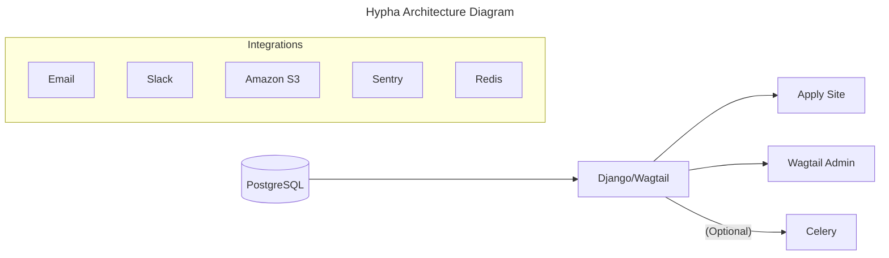

-----------

## Main Components

### Apply Site

Where people seeking for funds can apply by submitting their applications, the submission goes through different stages before it being approved for funding. After the applications are approved, they can be converted to a project. Apply site allows to manage the lifecycle of a project starting from a PAF to contracting to invoicing.

### Wagtail Admin

Used to create custom forms, setup funds/labs and workflow around them. Think of it as the back-office of for your submissions and projects.

-----------

## Under The Hood

### Django

Hypha is built on top of the Django Web Framework. All the pages are rendered server side. It uses wagtail CMS for creating and managing custom application forms, public pages and settings.

### Wagtail

Wagtail is used in Hypha to construct and manage forms, pages, users and user roles via an admin interface (and code). In other words, Hypha uses Wagtail to build pages (using `blocks`), modify view-level behavior (using `hooks`), and create an admin interface for customizing settings like user permissions.

**Hooks**: modifying the view-level behavior. Used in Hypha for copied round pages

### Media

Media is encouraged to be split into two distinct storage locations. A Public and a Private location, applicant media should exist only in the Private location. 

Media should also be served from a view that inherits from the [PrivateMediaView](https://github.com/HyphaApp/hypha/blob/main/hypha/apply/utils/storage.py) which will confirm that the file isn't made public and can be configured to return the file object from an authenticated view.

### Celery

An optional addition to allow certain tasks (ie. email/slack sending, other slower operations) to run asynchronously. Requires a separate celery worker to be running

## External Integrations

### Sentry

Hypha uses sentry to monitor and track errors in Django. You can either self host or use their SaaS offering.

### Slack

If configured, Hypha is able to send out notifications to different slack channels for activities happening on the Hypha application related to submissions and projects.

### Email

Emails in Hypha are used for password recovery and sending out important notifications to the users.

### Redis

Hypha uses Redis as a message broker for Celery