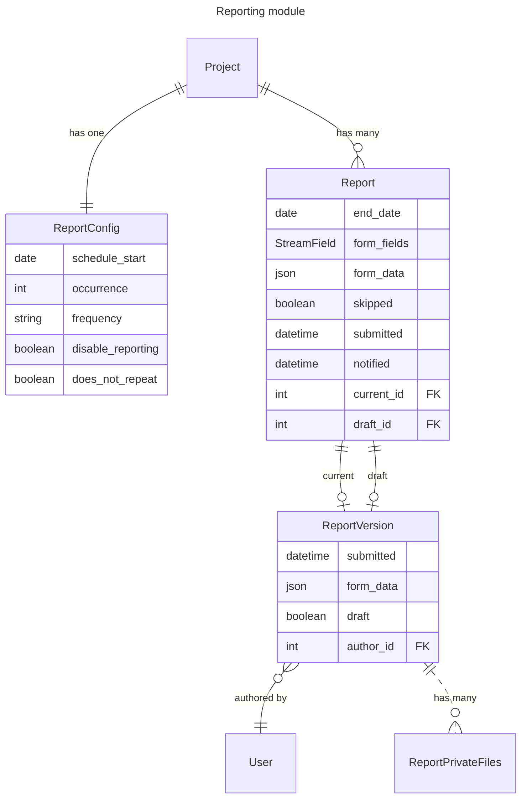
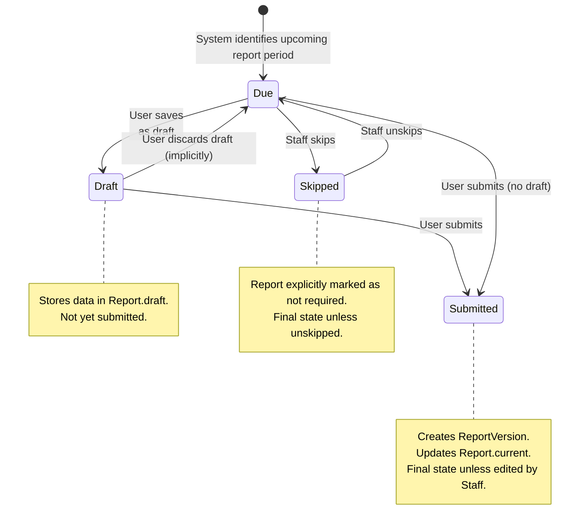
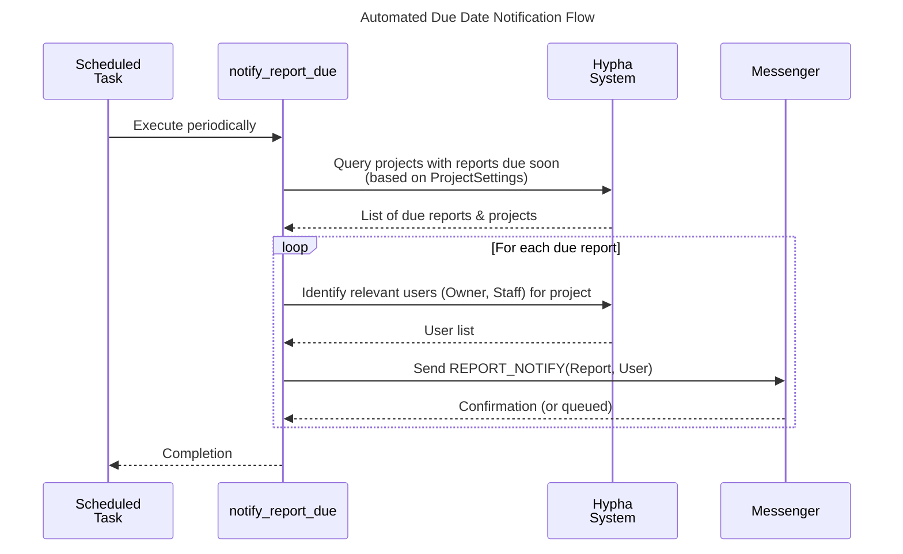

# Project Reports

The `hypha.apply.projects.reports` app provides functionality for managing periodic progress or financial reports associated with funded projects within the Hypha platform. It allows administrators to configure reporting schedules, project owners to submit reports using dynamic forms, and staff to track reporting status, view submitted reports, and manage the reporting lifecycle.

## Key Functionalities

- **Staff:** Configure reporting frequency, enable/disable reporting, view reporting status across projects, view submitted reports, edit submitted reports, skip reports, receive notifications.
- **Project Owners:** View reporting schedule, submit new reports, save draft reports, view their submitted reports, receive notifications.
- **Finance:** View submitted reports, view reporting status across projects.
- **System:** Automatically calculates reporting periods, sends due date reminders.

## Key Features

### Configurable Reporting Schedules

- **Frequency:** Define how often reports are due (Weeks, Months, Years).
- **Occurrence:** Specify the interval (e.g., every 2 weeks, every 3 months).
- **Start Date:** Set a specific date for the reporting schedule to commence or adjust.
- **One-Time Reporting:** Configure reports that do not repeat (`does_not_repeat`).
- **Enable/Disable:** Ability to completely disable reporting for a project.
- **Dynamic Calculation:** Automatically calculates the next due date based on the configuration and the last submitted report or project start date.
- Implemented via `ReportConfig`

### Dynamic Report Forms

- Reports utilize Hypha's `StreamField` functionality, allowing report forms to be dynamically constructed using various field types (text, numbers, dates, files, etc.).
- The specific form structure (`form_fields`) used for a report is associated with the `Report` model instance, often derived from a `ProjectReportForm` configured at the Fund level.
- Submitted data (`form_data`) is stored as JSON.
- Implemented via `Report`, `ReportEditForm` and `StreamField`

### Report Submission Workflow

- Project owners (and staff) can fill and submit reports corresponding to specific reporting periods.
- **Draft Mode:** Reports can be saved as drafts before final submission. The latest draft is stored separately (`Report.draft`).
- **Versioning:** Each submission creates a `ReportVersion`, storing the submitted data, timestamp, and author. The currently active submission is linked via `Report.current`.
- Implemented via `ReportUpdateView` and `ReportEditForm`

### Access Control & Permissions 

- Granular permissions control who can perform actions:
- `view_report`: Staff, Finance users, and the Project Owner can view submitted reports (if project status allows and report is not skipped).
- `update_report`: Staff and the Project Owner (only before initial submission) can edit/submit reports (if project status allows, report isn't skipped, and it's submittable).
- `update_report_config`: Staff can modify the reporting schedule (if project status allows and it's not a completed one-time report).
- Views enforce these permissions, raising `PermissionDenied` if rules aren't met.
- Implemented via `permissions.py` and Views

### Report Skipping

- Staff members have the ability to mark a due report as "skipped".
- This action can be undone. Skipping is generally only allowed for reports that haven't been submitted and aren't the *very next* one due according to the config.
- Implemented via `ReportSkipView`

### Status Tracking & Notifications

- **Due Dates:** Reports have calculated `start_date` and `end_date` for their period.
- **Status:** Reports can be implicitly categorized (e.g., "Due", "Submitted", "Skipped", "Draft"). The `ReportingTable` displays a calculated `current_report_status`.
- **Notifications (`notify_report_due.py`, `messenger`):**
    - An automated management command (`notify_report_due`) periodically checks for reports due soon (based on `ProjectSettings` reminder frequencies) and sends notifications (`REPORT_NOTIFY`).
    - Manual actions like submission (`SUBMIT_REPORT`), skipping (`SKIPPED_REPORT`), and frequency changes (`REPORT_FREQUENCY_CHANGED`) also trigger system messages/notifications.

### Private File Attachments

- Reports can include file uploads.
- These files are stored using private storage (`PrivateStorage`) ensuring they are not publicly accessible.
- A dedicated view (`ReportPrivateMedia`) serves these files, checking permissions and ensuring only files from the current, live report version are served directly.
- Implemented via `ReportPrivateFiles` and `ReportPrivateMedia`

### Admin/Staff Views 

- Dedicated table views for Staff/Finance users:
    - `ReportingView`: Lists projects and their current reporting status, due dates, and notification status. Filterable by status.
    - `ReportListView`: Lists all submitted reports across projects. Filterable by reporting period and submission date.
- Implemented via `ReportListView`, `ReportingView`, `tables.py`, `filters.py`.

## Known Limitations

1.  **Single Active Report Form Definition:** The system pulls the report form structure (`form_fields`) from the associated Fund page (`project.submission.page.specific.report_forms.first()`) when a `Report` instance is first created or needs its fields defined. While this structure is saved with the `Report`, there is no explicit mechanism within this app's code to use *different* report form structures for different reporting periods of the *same* project without changing the Fund configuration itself.
2.  **No Explicit Report Review Cycle:** Unlike application reviews, this app lacks a built-in, multi-stage review process for submitted reports (e.g., "Needs Revision", "Approved"). Reports are Draft, Submitted, or Skipped.
3.  **Basic Notification Rules:** The automated due date notification logic is tied to predefined reminder intervals (`ProjectReminderFrequency`). More complex escalation logic (e.g., different message if report is >2 weeks late) is not supported.
4.  **Simple Schedule Calculation:** The `next_date` calculation is based on adding fixed weeks, months, or years. It doesn't support more complex financial or business calendars (e.g., "end of quarter", "last working day").
5.  **Reporting Tied to Project Status:** Report submission and configuration updates are restricted based on project status, primarily occurring during the `INVOICING_AND_REPORTING` phase. Viewing submitted reports is possible in other statuses like `COMPLETE` or `CLOSING`, subject to permissions.
6.  **No Bulk Actions in UI:** The provided table views (`ReportListView`, `ReportingView`) do not provide UI elements for performing bulk actions (e.g., bulk skipping, bulk notifying).
7.  **Fixed Permission Roles:** Access control is tightly coupled to predefined roles (Staff, Finance, StaffAdmin) and Project Ownership. Assigning report-specific permissions to arbitrary users is not directly supported by the `permissions.py` module.
