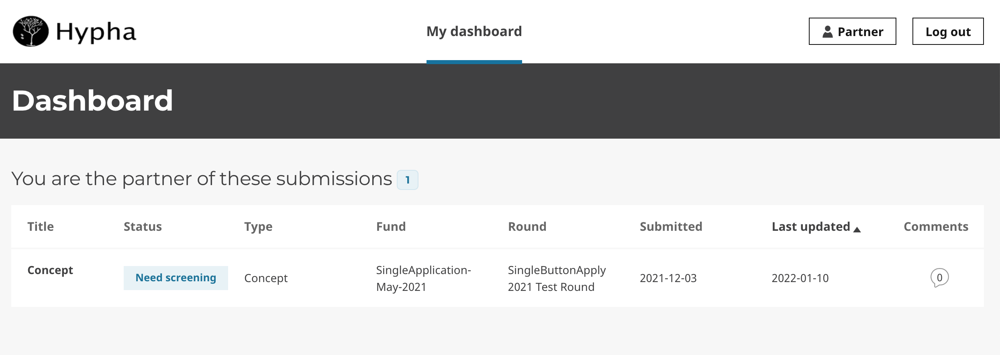
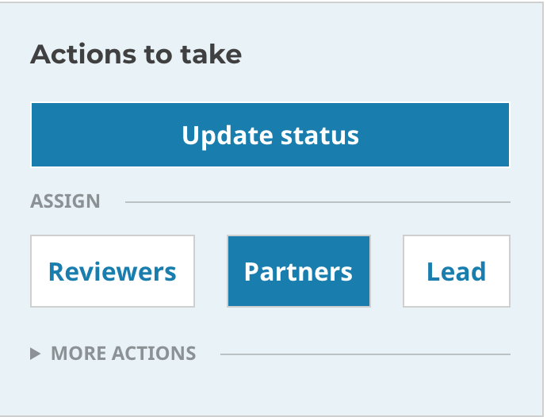
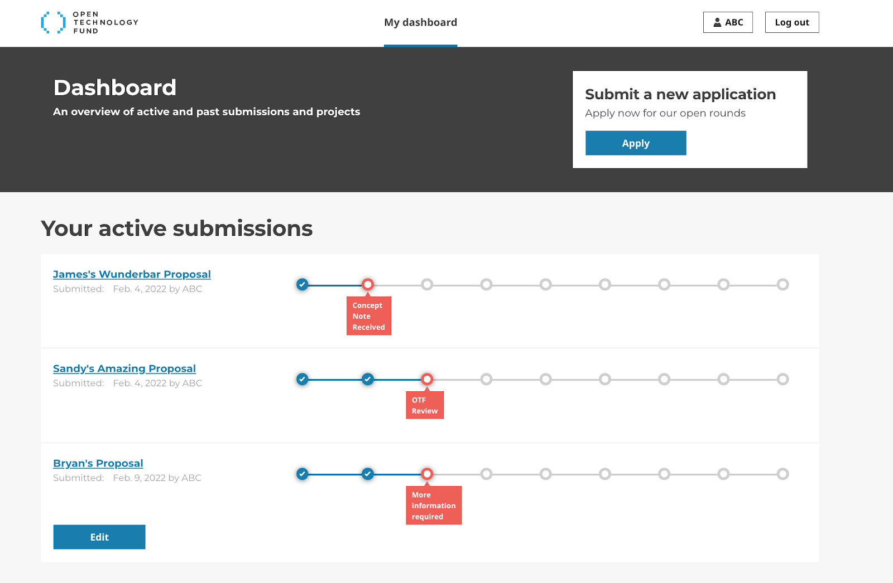

# User Roles

## User Roles vs. User Groups

User Group refers to every account within this particular group. 

Go to `Settings -> Groups`. Clicking on the group name, e.g. "Staff", takes you to the permission page where you set what wagtail permissions staff should have. 

For example, system administrators could adjust the administrative access or permissions of every account or individual with the "Staff" user role.

Hypha comes with the following user roles that has special permissions:

- [User Roles vs. User Groups](#user-roles-vs-user-groups)
- [Staff](#staff)
- [Partner](#partner)
- [Reviewer](#reviewer)
- [Applicant](#applicant)
- [Additional Roles](#additional-roles)

## Staff

The **Staff** role could submit reviews, send determinations, and set up applications (this means creating Forms, Funds, and Rounds, and give other users (e.g. Reviewers or other Staff) access to applications/submissions.

Staff can:

* Create accounts for other **Staff**, **Reviewers**, and **Applicants**
* Deactivate other user accounts
* Modify roles for other users
* Set up applications (this means creating Forms, Funds, and Rounds
* View applications/submissions
* Give other users (ie Reviewers, Partners) access to submissions
* Review submissions
* Draft and send correspondence
* Write a comment to applicants and other users on the platform

Account created by **Staff** & assigned to either "Fund" or specific application(s)

## Partner

The **Partner** role could be access, edit, and communicate about a specific application they are assigned to. This role could be accessed when two or more people are working together on a single application; one applicant gets **Applicant** role, and additional applicants get this role. OTF use the partner role for fellowship host organizations, service providers, etc.

A **Partner can**:

* View, edit, and communicate about a specific application
* Used when two or more people are working together on an application; one applicant gets **Applicant** role, and additional applicants get this role

> ℹ️ _This role is created by Staff and associated with a specific application_

The **Partner** role could be access, edit, and communicate about a specific application they are assigned to. OTF use the partner role for fellowship host organizations, service providers, etc.

The Partner could only review applications that has been assigned to them. Applications assigned to the Partner are available on their dashboard.

The Partner role could be associated or assigned to an application by clicking on Partner button in the **Actions to take** > Assign.

## Reviewer

The **Reviewer** role has their own dashboard and can submit reviews. OTF's Advisory Council Members are often assigned the 'Reviewer' role.

**Staff** could create **Reviewer** accounts.

A **Reviewer** can:

* The Staff role could also specify the Reviewer's role level of access and permissions on the platform.
* Staff could also assign reviewers to specific Funds and Labs, enabling individuals with the reviewer role access to a particular Fund or Lab.
* Reviewers could access and review application(s) they have been assigned
* Draft and submit Review Forms for application(s)
* A reviewer's communication could be visible to staff, applicants, and other reviewers, or only with staff. These settings are determined by the implementing organization.

## Applicant

The **Applicant** role can access their own application and communicate with OTF in the communication/comment tab.

Any applicant could create their user account automatically when the applicant submits a submission.

An **Applicant** can:

* Create, edit, and submit application(s)
* Contact staff regarding own application
* Track the status of their application(s) on their platform

## Additional Roles

New roles can be created and permissions (capabilities) for these roles can be set in Wagtail by the person deploying Hypha for your organization.

_For example, several of the following roles were created for different Hypha adopters:_

* Community Reviewer
* Team Admin
* Finance
* Approver
