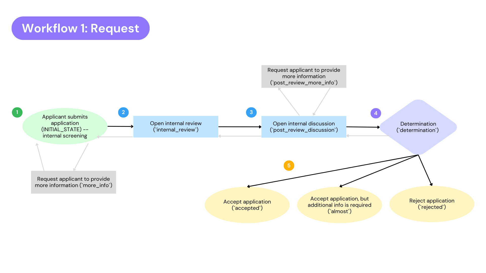
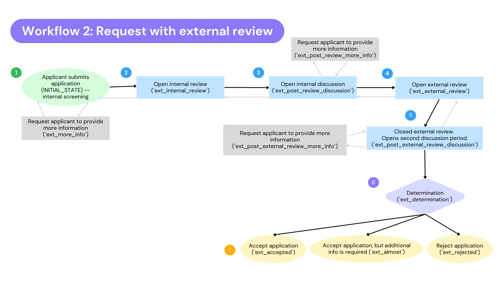
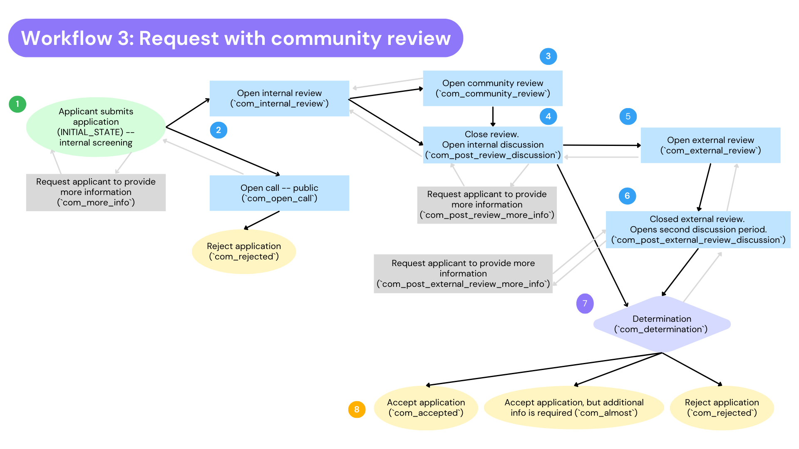
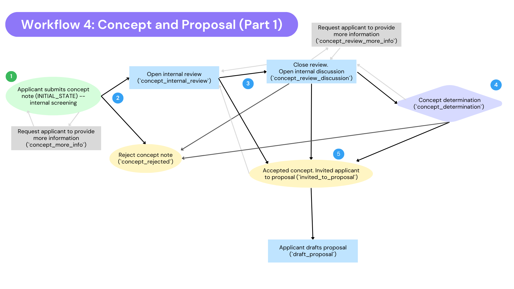
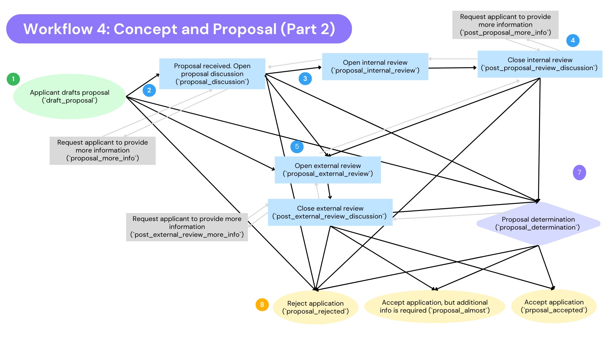

The **Workflow** defines the stages and processes that the application should undertake. Creating a new Fund or Lab requires you to select one of these workflows.

Each workflow has a predetermined amount of stages (e.g. request, proposal), application forms, review forms, and determination forms associated with this Fund or Lab.

Each workflow offers different statuses (e.g. External Review, Ready for Determination), and different actions (e.g Invite to proposal).

!!! info
    Hypha covers more than just the application phase, but workflows are used in the application process only.

## What are the 6 workflows?

1. [Request](#request)
2. [Request with same time review](#request-with-same-time-review) (new in v5.20.0)
3. [Request with external review](#request-with-external-review)
4. [Request with community review](#request-with-community-review)
5. [Request external then internal review](#request-external-then-internal-review)
6. [Concept and Proposal](#concept-and-proposal)

All workflows begin with applicant drafting, revising and submitting an application (`DRAFT_STATE`) — only transition available is to `INITIAL_STATE`, upon applicant taking the action to submit their application/request.

### 💁 Request

The request workflow is a single stage process with no advisory council review. This application process requires less time and effort than the other workflow processes.

**Proposal Persona:**

Funding organization offers a rapid response fund or another type of grantmaking that requires a streamline process that does not require an external review process. This application process could also be used for in-kind services like coaching, security audits, etc.

Once an application is submitted (`INITIAL_STATE`) — it can transition into the following:

- A request for more information (`more_info`) — opens editing permissions to applicant again to revise their application to provide the information requested by the screeners.
- Open review (`internal_review`) — can transition only between closing review period (`post_review_discussion`) and reverting back to the internal screening phase.
  - `post_review_discussion` — after review is closed, you can request more information (`post_review_more_info`), ready for determination (`determination`), revert back to opening the review (`internal_review`), accept but additional info is needed (`almost`), accept (`accepted`) or reject (`rejected`)
  - `post_review_more_info` — opens editing permissions to applicant again to revise their application to provide the information requested by the reviewers.
- Ready for determination (`determination`) — can revert back to discussion (“Ready For Discussion (revert)” — `post_review_discussion`) , or accept with additional info needed (`almost`), accept (`accepted`) or reject (`rejected`)
- Accepted, but additional info is needed (`almost`) — opens editing permissions to applicant again to revise their application to provide the information requested by the reviewers, admin, or staff positions.
- Accepted (`accepted`) — application accepted. Staff can still edit this submission.
- Rejected (`rejected`) — application rejected. Permissions removed from all roles.

### 👳 Request with same time review

This workflow is a single stage process with an advisory council review or external review stage -- includes functionalities for external reviewers like advisory board members to access applications and submit reviews.

It is very similar to the "Request with external review" workflow, see below, but the internal and external review step happens at the same step.

Beware if you opt to customise the "Reviewer Settings" (in Wagtail admin). Only the "All states" option in the "State" setting will work with this workflow.

Once an application is submitted (`INITIAL_STATE`) — it can transition into the following:

- A request for more information (`same_more_info`) — opens editing permissions to applicant again to revise their application to provide the information requested by the screeners.
- Open review (`same_internal_review`) — can transition only between closing review period (`same_post_review_discussion`) and reverting back to the internal screening phase.
  - `same_post_review_discussion` — after review is closed, you can request more information (`same_post_review_more_info`), ready for determination (`same_determination`), revert back to opening the review (`same_internal_review`), or reject (`same_rejected`)
  - `same_post_review_more_info` — opens editing permissions to applicant again to revise their application to provide the information requested by the screeners.
- Ready for determination (`same_determination`) — can revert back to discussion (“Ready For Discussion (revert)” — `same_post_review_discussion`) , or accept with additional info needed (`same_almost`), accept (`same_accepted`) or reject (`same_rejected`)
- Accepted, but additional info is needed (`same_almost`) — opens editing permissions to applicant again to revise their application to provide the information requested by the reviewers, admin, or staff positions.
- Accepted (`same_accepted`) — application accepted. Staff can still edit this submission.
- Rejected (`same_rejected`) — application rejected. Permissions removed from all roles.

### 👳 Request with external review

This workflow is a single stage process with an advisory council review or external review stage -- includes functionalities for external reviewers like advisory board members to access applications and submit reviews.

Proposal Persona: This funding organization relies on external partners for evaluations. Proposals submitted to this workflow are reviewed by staff members and an advisory board that is made up of trusted community members.

Once an application is submitted (`INITIAL_STATE`) — it can transition into the following:

- A request for more information (`ext_more_info`) — opens editing permissions to applicant again to revise their application to provide the information requested by the screeners.
- Open review (`ext_internal_review`) — can transition only between closing review period (`ext_post_review_discussion`) and reverting back to the internal screening phase.
  - `ext_post_review_discussion` — after review is closed, you can request more information (`ext_post_review_more_info`), open the external review(`ext_external_review`), ready for determination (`ext_determination`), revert back to opening the review (`ext_internal_review`), or reject (`ext_rejected`)
  - `ext_post_review_more_info` — opens editing permissions to applicant again to revise their application to provide the information requested by the screeners.
- External review (`ext_external_review`) — can only transition between closing the review (`ext_post_external_review_discussion`) and reverting back to discussion (`ext_post_review_discussion`)
  - `ext_post_external_review_discussion` — can transition to a request more information (`ext_post_external_review_more_info`), ready for determination (`ext_determination`), revert back to opening the external review (`ext_external_review`), accept but additional info is needed (`ext_almost`), accept (`ext_accepted`) or reject (`ext_rejected`)
  - `ext_post_external_review_more_info` — opens editing permissions to applicant again to revise their application to provide the information requested by the reviewers.
- Ready for determination (`ext_determination`) — can revert back to discussion (“Ready For Discussion (revert)” — `ext_post_external_review_discussion`) , or accept with additional info needed (`ext_almost`), accept (`ext_accepted`) or reject (`ext_rejected`)
- Accepted, but additional info is needed (`ext_almost`) — opens editing permissions to applicant again to revise their application to provide the information requested by the reviewers, admin, or staff positions.
- Accepted (`ext_accepted`) — application accepted. Staff can still edit this submission.
- Rejected (`ext_rejected`) — application rejected. Permissions removed from all roles.

### 👪 Request with community review

This workflow is a single stage application process with functionalities for external reviewers, including applicants to carry out peer review of each other applications.

**Proposal Persona:** 

This funding organization works with the community to co-design a meaningful definition of success. Applications are reviewed by staff members and an advisory board that is made up of trusted community members.

Once an application is submitted (`INITIAL_STATE`) — it can transition into the following:

- A request for more information (`com_more_info`) — opens editing permissions to applicant again to revise their application to provide the information requested by the screeners.
- Open call (public) (`com_open_call`) — from here- the only two transitions available are to either revert back to screening or to reject the application (`com_rejected`)
- Open Review (`com_internal_review`) — can transition to open community review (`com_community_review`), close review (`com_post_review_discussion`), revert to initial state / screening period, or reject application (`com_rejected`)
- Open Community Review — can transition to close review (`com_post_review_discussion`), revert back to opening internal review (`com_internal_review`), or rejecting application (`com_rejected`)
- Closed review (`com_post_review_discussion`) — can transition to a request for more information (`com_post_review_more_info`), open external review (`com_external_review`), mark application as ready for determination (`com_determination`), revert back to internal review (`com_internal_review`), or reject application (`com_rejected`)
  - Request more information (`com_post_review_more_info`) — opens editing permissions to applicant again to revise their application to provide the information requested by the reviewers
- Open external review (`com_external_review`) — can transition to closing review (`com_post_external_review_discussion`) or revert back to discussion (`com_post_review_discussion`)
- Closed review (`com_post_external_review_discussion`) — can transition into a request for more information (`com_post_external_review_more_info`), mark application as ready for determination (`com_determination`), revert back to external review (`com_external_review`), mark application as accepted but additional information is required (`com_almost`), accept application (`com_accepted`), or reject application (`com_rejected`)
  - Request more information (`com_post_external_review_more_info`) — opens editing permissions to applicant again to revise their application to provide the information requested by the external reviewers
- Mark application as ready for determination (`com_determination`) — can transition to revert back to marking application as ready for discussion (`com_post_external_review_discussion`), mark application as accepted but additional information is required (`com_almost`), accept application (`com_accepted`), or reject application (`com_rejected`)
- Accept application (`com_accepted`)
- Accept application but additional information is required (`com_almost`) — can transition to accepting application (`com_accepted`) or revert back to ready for discussion (`com_post_external_review_discussion`)
- Reject application (`com_rejected`)

### 🔀 Request external then internal review

This workflow is a single stage process with both an external review and an internal review stage. It is very similar to the "Request with external review" workflow, see above, but the order of the two review steps is reversed: the external reviewers see the application first, and the internal review only opens once the external review has been closed.

The internal review is optional — an application can be accepted, waitlisted or dismissed straight after the external review has been closed.

It is also the only workflow that offers **Waitlisted** as an outcome, alongside Accepted and Dismissed.

**Proposal Persona:**

Funding organization wants an advisory board or external partners to give their opinion before staff spend time on an internal review, and needs to be able to park promising applications on a waitlist while funding decisions are made.

Once an application is submitted (`INITIAL_STATE`) — it can transition into the following:

- A request for more information (`ext_int_more_info`) — opens editing permissions to applicant again to revise their application to provide the information requested by the screeners.
- Open external review (`ext_int_external_review`) — can transition only between closing the review period (`ext_int_post_external_review_discussion`) and reverting back to the internal screening phase.
  - `ext_int_post_external_review_discussion` — after the external review is closed, you can request more information (`ext_int_post_external_review_more_info`), open the internal review (`ext_int_internal_review`), mark ready for determination (`ext_int_determination`), revert back to opening the external review (`ext_int_external_review`), accept (`ext_int_accepted`), waitlist (`ext_int_waitlisted`) or dismiss (`ext_int_rejected`)
  - `ext_int_post_external_review_more_info` — opens editing permissions to applicant again to revise their application to provide the information requested by the external reviewers.
- Open internal review (`ext_int_internal_review`) — can transition only between closing the review period (`ext_int_post_review_discussion`) and reverting back to discussion (`ext_int_post_external_review_discussion`)
  - `ext_int_post_review_discussion` — after the internal review is closed, you can request more information (`ext_int_post_review_more_info`), mark ready for determination (`ext_int_determination`), revert back to opening the internal review (`ext_int_internal_review`), accept (`ext_int_accepted`), waitlist (`ext_int_waitlisted`) or dismiss (`ext_int_rejected`)
  - `ext_int_post_review_more_info` — opens editing permissions to applicant again to revise their application to provide the information requested by the reviewers.
- Ready for determination (`ext_int_determination`) — can revert back to discussion (“Ready For Discussion (revert)” — `ext_int_post_review_discussion`), accept (`ext_int_accepted`), waitlist (`ext_int_waitlisted`) or dismiss (`ext_int_rejected`)
- Waitlisted (`ext_int_waitlisted`) — the application is kept in play without a decision. Can transition to accept (`ext_int_accepted`), dismiss (`ext_int_rejected`), or revert back to ready for determination (`ext_int_determination`). Staff can still edit this submission. Waitlisting is a plain status change — unlike Accept and Dismiss it does not open the determination form and does not create a determination record.
- Accepted (`ext_int_accepted`) — application accepted. Staff can still edit this submission.
- Dismissed (`ext_int_rejected`) — application rejected. Editing and reviewing permissions removed from all roles, the applicant can still view the submission.

There is no "Accepted but additional info required" state in this workflow.

If the `TRANSITION_AFTER_REVIEWS` setting is set to a number, submitting a review can move the application on automatically:

- Need screening → External Review, as soon as the first review is submitted. The configured number is not taken into account for this step, and only staff can review during screening.
- External Review → Ready For Discussion, once that many reviews have been submitted by users in the Reviewer group.
- Internal Review → Ready For Discussion, once that many reviews have been submitted in total.

The automatic transition is skipped if the user submitting the review is not allowed to make it.

**What the applicant sees**

Everything from the first discussion onwards is hidden from the applicant. The status bar shows four steps:

1. **Draft** (`draft`)
2. **Application Received** (`INITIAL_STATE`, "Need screening" to staff)
3. **Application Review** (`ext_int_external_review`, "External Review" to staff)
4. **Application Outcome** — shown as Accepted (`ext_int_accepted`), Waitlisted (`ext_int_waitlisted`) or Dismissed (`ext_int_rejected`) once the application reaches that step

The hidden phases (`ext_int_post_external_review_discussion`, `ext_int_internal_review`, `ext_int_post_review_discussion` and `ext_int_determination`) do not add a step of their own — to the applicant the application stays on "Application Review" until an outcome is reached. The three "More information required" states are visible to the applicant, since they need to edit and resubmit their application.

### 💡 Concept and Proposal

This workflow is a two-stage process: the first stage is the request and the second stage includes an advisory council review or external review stage.

**Proposal Persona:** 

This application process is continually informed by feedback from grantee partners and community members. Applicants could use the workflow to follow the trajectory of the submission process as this workflow is transparent from the concept note (first stage) all the way to the proposal (second stage) with prospective and current applicants about funding priorities and decisions.
The proposal stage has functionalities for applications to be reviewed by staff members and an advisory board that is made up of trusted community members.

**Stage 1**

**Stage 2**

Once an application is submitted (`INITIAL_STATE`) — it can transition into the following:

- A request for more information (`concept_more_info`) — opens editing permissions to applicant again to revise their application to provide the information requested by the screeners
- Reject concept note (`concept_rejected`)
- Open Review (`concept_internal_review`) — can transition into closing the review (`concept_review_discussion`), revert back to screening (initial state), or invite applicant to proposal (`invited_to_proposal`)
- Closed review (`concept_review_discussion`) — can transition to a request for more information (`concept_review_more_info`), mark application as ready for preliminary determination (`concept_determination`), revert back to open review (`concept_internal_review`), invite applicant to submit a proposal (`invited_to_proposal`), or reject application (`concept_rejected`)
  - Request for more information (`concept_review_more_info`) — opens editing permissions to applicant again to revise their application to provide the information requested by the reviewers
- Mark application as ready for preliminary determination (`concept_determination`) — can transition to revert to discussion (`concept_review_discussion`), invite applicant to submit proposal (`invited_to_proposal`), or reject application (`concept_rejected`)
- Invite applicant to proposal (invited_to_proposal`) — accepts the concept and can transition into `draft_proposal`
- Applicant drafts proposal (`draft_proposal`) — can transition into (`proposal_discussion`), open external review (`external_review`), mark application as ready for final determination (`proposal_determination`), or reject proposal (`proposal_rejected`)
- Proposal discussion (`proposal_discussion`) — can transition into a request for more info (`proposal_more_info`), open internal review (`proposal_internal_review`), open external review (`proposal_external_review`), mark application as ready for final determination (`proposal_determination`) or reject application (`proposal_rejected`)
  - Request for more info (`proposal_more_info`) — opens editing permissions to applicant again to revise their application to provide the information requested by the reviewers
- Internal review (`proposal_internal_review`) — can transition into closing review (`post_proposal_review_discussion`), or revert back to “Proposal Received” `proposal_discussion`
- Closed internal review (`post_proposal_review_discussion`) — can transition to a request for more info (`post_proposal_review_more_info`), open external review (`external_review`), mark application as ready for final determination (`proposal_determination`), revert back to opening internal review (`proposal_internal_review`), or reject proposal (`proposal_rejected`)
  - Request for more info (`post_proposal_review_more_info`) — opens editing permissions to applicant again to revise their application to provide the information requested by the internal reviewers
- External review (`external_review`) — can transition to closing review (`post_external_review_discussion`) or revert back to discussion (`post_proposal_review_discussion`)
- Closed external review (`post_external_review_discussion`) — can transition to a request for more info (`post+external_review_more_info`), mark application as ready for final determination (`proposal_determination`), revert back to opening external review (`external_review`), accept proposal but require additional information (`proposal_almost`), accept proposal (`proposal_accepted`), reject proposal (`proposal_rejected`)
  - Request more information (`post_external_review_more_info`) — opens editing permissions to applicant again to revise their application to provide the information requested by the external reviewers
- Proposal determination (`proposal_determination`) — can transition to revert back to discussion (`post_external_review_discussion`), accept proposal but require additional info (`proposal_almost`), accept proposal (`proposal_accepted`) , or reject proposal (`proposal_rejected`)
- Proposal accepted (`proposal_accepted`)
- Proposal accepted but additional info required (`proposal_almost`)
- Proposal rejected (`proposal_rejected`)
