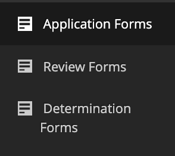
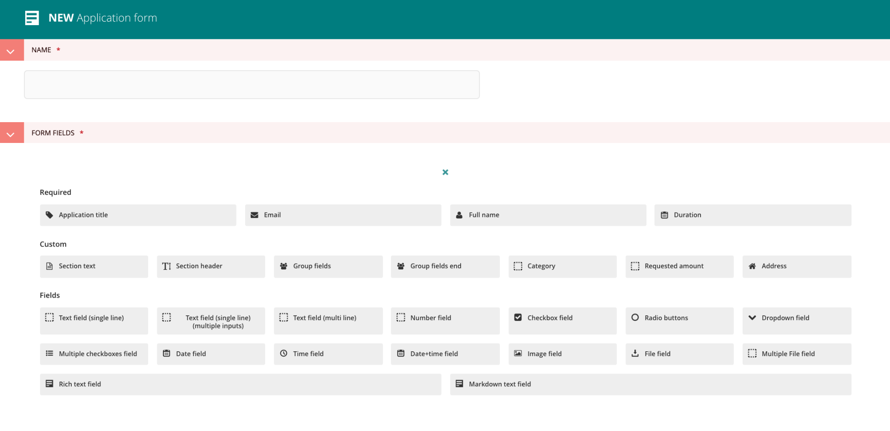
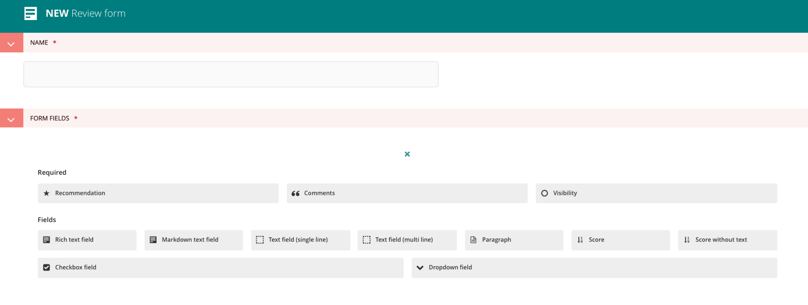
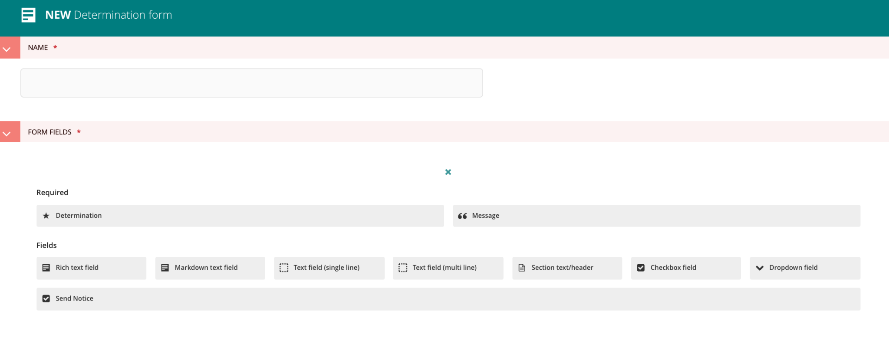
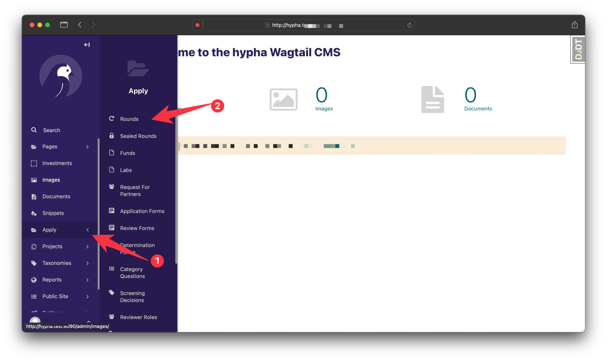
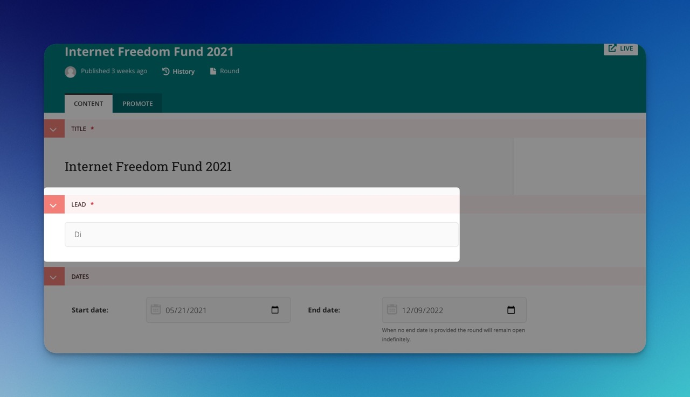
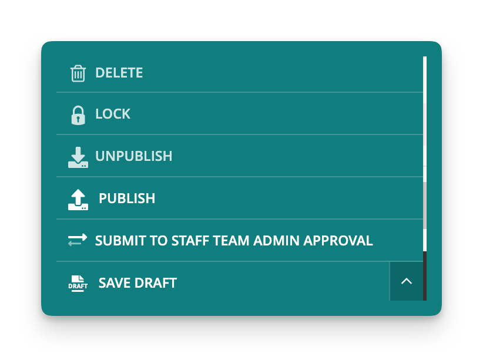

# Creating Submission Application

All admin actions associated with applications can be access through the “Apply” menu. This is found in the left navigation of the admin area. Clicking on the “Apply” menu item opens up the sub menu.

## Setup a form

There are several types of Forms in the WagTail Admin. Forms are used to create a Fund.

**Application Form**

**Review Form**

**Determination Form**

****

In this guide menu elements will be referred to using “\[ ]” to indicate the button and “>” to indicate a subsequent menu item.

## **Add a new fund in the top right or copy an existing fund**

* You will then be able to add the following information
  * Name of the fund (Title)
  * Select External Reviewers
  * Workflow
    * Workflow defines the stages and processes that the application should undertake
    * Currently there are four workflows you can select.
  * Assign application forms
    * Select a previously created application form
    * Number validated against the workflow chosen above (i.e. if it is a concept/proposal workflow 2 forms must be selected)
  * Assign review forms
    * Select a previously created review form
    * Number validated against the workflow chosen above (i.e. if it is a concept/proposal workflow 2 forms must be selected)
  * Confirmation email
* Publishing the fund or lab is required to make sure that the application form is publicly visible to potential applicants.

## Setup a round

Currently users can copy, clone, or duplicate a Fund before creating a new form. Duplicating a Fund/Lab also duplicates the forms associated with that particular Fund or Lab. **Users can not preview form, Fund needs to be published on live site for users to view draft or completed version**

1. Open Apply and click the bird icon on the bottom-right corner, then click the “Go to Wagtail admin” pop-up
2. Click `Apply` > `Rounds`

3\. Go to the round and click the Edit button:

4\. Enter the Start Date (ie first day of the month) and End Date (ie last day of the month). Not selecting an end date allows the application to be open to the public indefinitely.

5\. Update the title and slug.

6\. Enter the Lead's name

7\. Check to ensure the correct reviewers are highlighted

8\. You could save a draft or publish. Publish means the application will be publicly visible to applicants.

