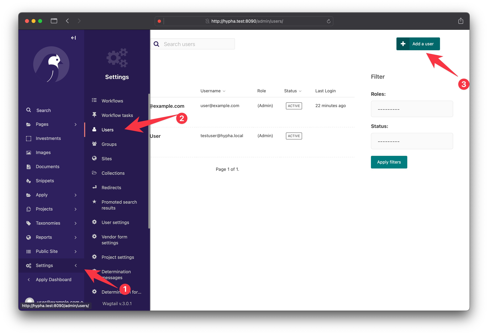
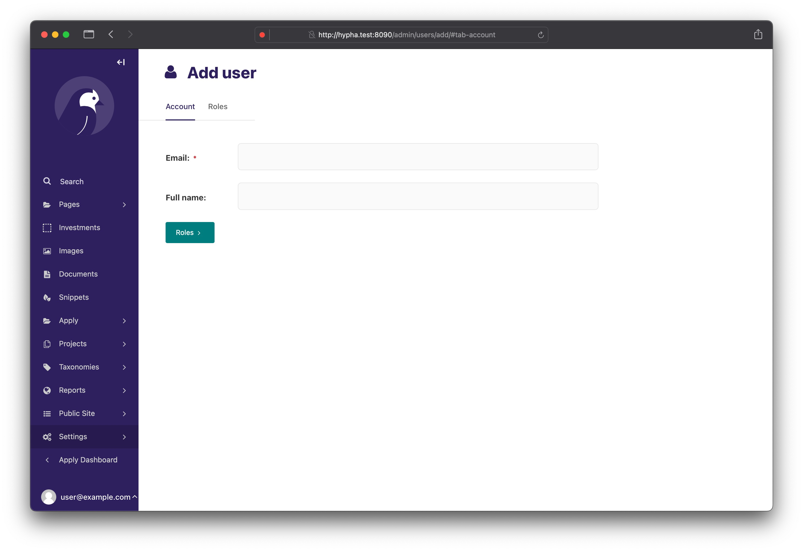
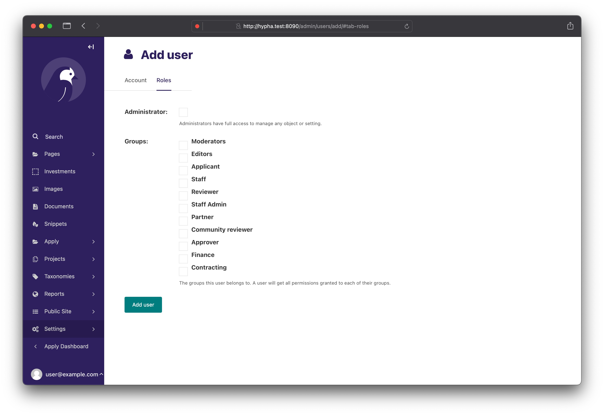
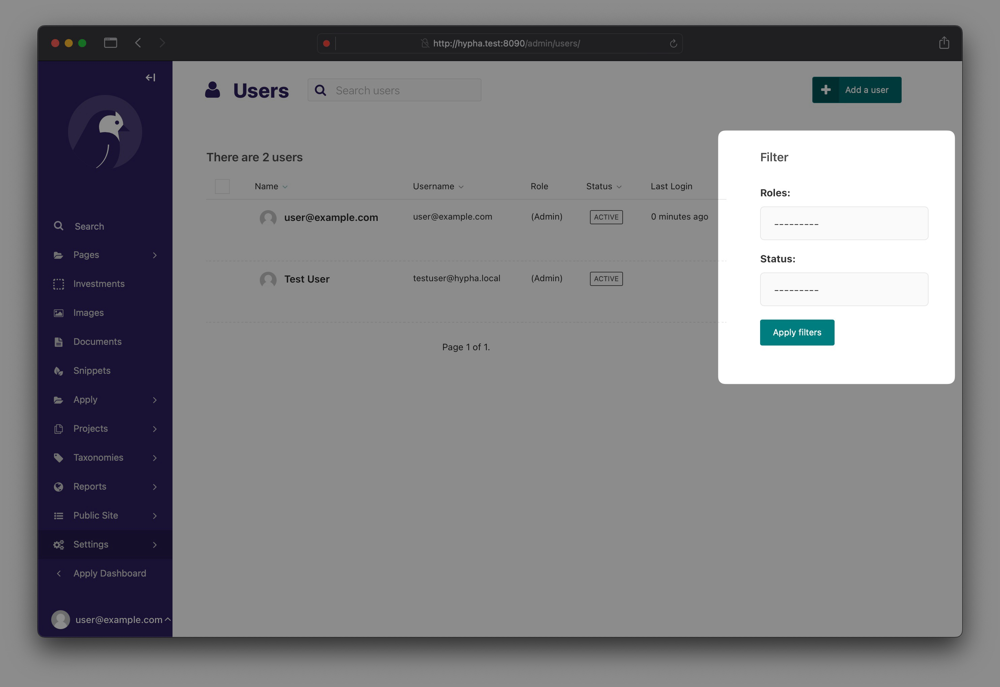

## Using command-line Interface

### Creating superuser


```shell
python3 manage.py createsuperuser
```

The user created is an "administrator" role, a default Django role that bypasses any access restrictions, like 'root' on a Unix server.

This role should only be used by the person implementing/deploying Hypha for your organization, who may be part of the organization or may be an external contractor.

### Creating additional users

Creating additional users and assigning them Roles is done in Wagtail by someone with the Staff role.

## Using Wagtail Admin

!!! info
    Only users with the ["Staff"](../references/user-roles.md#staff) role or a Super Admin can do this.

In the WagTail Admin, you could create a new user account as well as assign a role to a user account by clicking on the "Add User" button on the far right-hand corner of the screen. You can also search for users in the search bar. User roles are essential to WagTail and the Hypha platform. System Administrators are able to oversee user accounts and manage the level of access for different users. 



The "Add User" form will request your email, name, and role within the platform.



Selecting a role with enable to administrative access within the platform. Commonly used roles within the platform are **Staff**, **Partner**, and **Reviewer**.




### Filtering by Roles and Status

You could quickly search for user groups and their status (ie active or inactive) using the filter. The search function shows the user account's most recent login date. 


